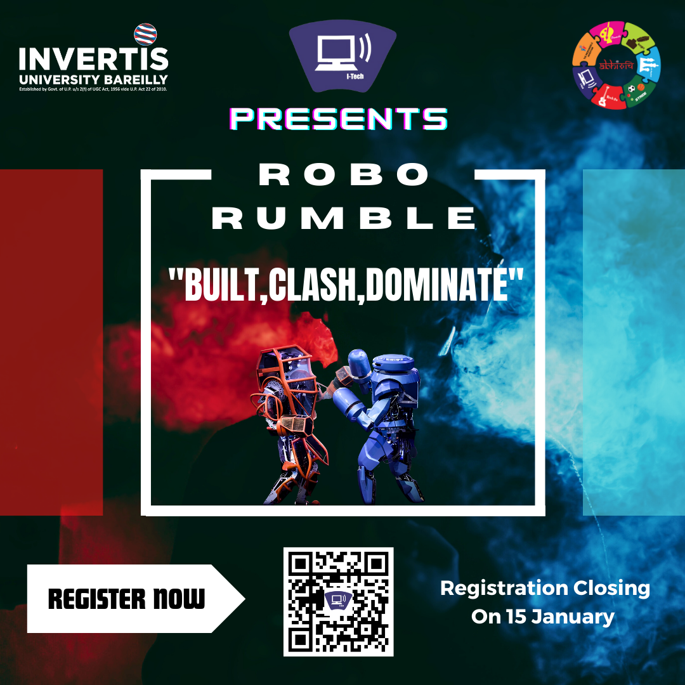

# Abhishek Maheshwari - Portfolio Website

## 🚀 Overview
A modern, responsive, and visually stunning portfolio website showcasing my skills, projects, and professional journey as a BCA student and aspiring Data Analyst. Built with a focus on UI/UX, utilizing a Cyber/Neon aesthetic with glassmorphism effects.



## ✨ Features
-   **Interactive Background**: Dynamic particle network animation using HTML5 Canvas.
-   **Modern Design**: Deep dark theme with Neon Cyan & Pink accents and Glassmorphism cards.
-   **Responsive**: Fully responsive design that works seamlessly on Desktop, Tablet, and Mobile.
-   **Downloadable Resume**: Direct access to my resume from the hero section.
-   **Project Showcase**: Highlighted projects like "Friendship Fun Website", "Hangman", and Canva designs.

## 🛠️ Tech Stack
-   **Frontend**: HTML5, CSS3 (Custom Variables, Flexbox, Grid), JavaScript (ES6+).
-   **Design**: Custom CSS styles without external frameworks (Pure CSS).
-   **Icons**: FontAwesome 6.
-   **Fonts**: 'Outfit' and 'Space Grotesk' from Google Fonts.

## 🌐 Live Demo
[**Click Here to View Live Portfolio**](https://Abhishek-Maheshwari-778.github.io/Basic_Portfolio_Website/)
*(Note: If this link doesn't work yet, ensure you have enabled GitHub Pages in repository settings)*

## 🚀 How to Host This Website (Free)

This project is ready to be hosted on **GitHub Pages** for free.

1.  **Push Changes**:
    The code is already set up. You just need to push it to your repository:
    ```bash
    git add .
    git commit -m "Final portfolio update"
    git push origin main
    ```

2.  **Enable GitHub Pages**:
    -   Go to your repository: [https://github.com/Abhishek-Maheshwari-778/Basic_Portfolio_Website](https://github.com/Abhishek-Maheshwari-778/Basic_Portfolio_Website)
    -   Click on **Settings** (top right tab).
    -   On the left sidebar, click **Pages**.
    -   Under **Build and deployment** > **Branch**, select `main` and click **Save**.

3.  **Done!**:
    -   Wait 1-2 minutes.
    -   Your website will be live at: `https://Abhishek-Maheshwari-778.github.io/Basic_Portfolio_Website/`

## 📬 Contact
-   **LinkedIn**: [Connect on LinkedIn](https://www.linkedin.com/in/abhishek-maheshwari-220a88338)
-   **Email**: abhishekmaheshwari2436@gmail.com
-   **Fun Site**: [Friendship Fun](https://friendship-with-me.vercel.app/)

---
© 2024 Abhishek Maheshwari. Made with ❤️.